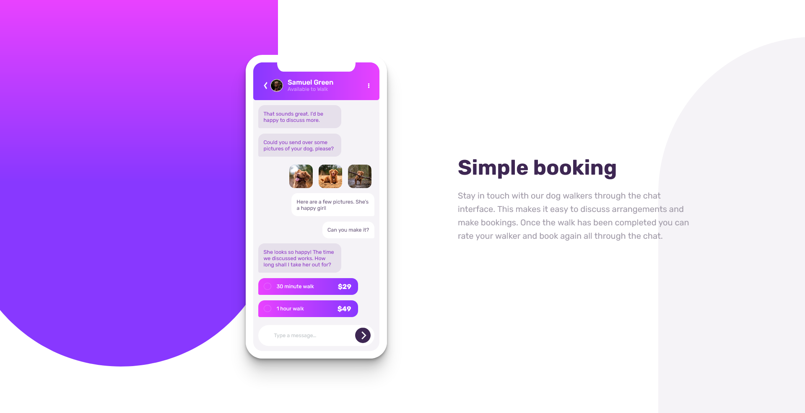
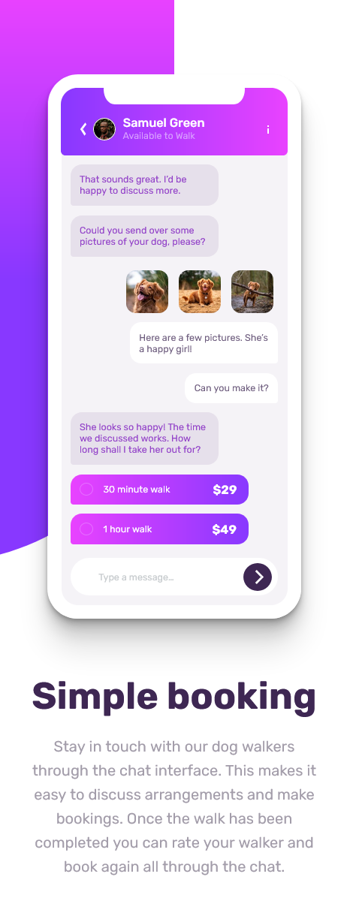

# Frontend Mentor - Chat app CSS illustration solution

This is a solution to the [Chat app CSS illustration challenge on Frontend Mentor](https://www.frontendmentor.io/challenges/chat-app-css-illustration-O5auMkFqY). Frontend Mentor challenges help you improve your coding skills by building realistic projects. 

## Table of contents

- [Overview](#overview)
  - [The challenge](#the-challenge)
  - [Screenshot](#screenshot)
  - [Links](#links)
- [My process](#my-process)
  - [Built with](#built-with)
  - [What I learned](#what-i-learned)
  - [Continued development](#continued-development)
  - [Useful resources](#useful-resources)

## Overview

### The challenge

Users should be able to:

- View the optimal layout for the component depending on their device's screen size
- **Bonus**: See the chat interface animate on the initial load

### Screenshot

Live Site URL: [GitHub page](https://thomas-auffroy.github.io/chat-app-Frontend/)

## My process

### Built with

- Semantic HTML5 markup
- CSS custom properties
- Flexbox

### What I learned

For the first time I created a complex shape using only css (the mobile phone). I go deeper onto animation too, but I see the limits of CSS for that and I am considering to learn javascript. I manage quit well the display of my elements, I guess I learned a lot from my previous challenges

### Continued development

Just keep practicing, and maybe learn Js

### Useful resources

[mozilla docs](https://developer.mozilla.org/en-US/docs/Web/CSS) - When I need to google something, I try to look for at this website, it seems complete to me.
